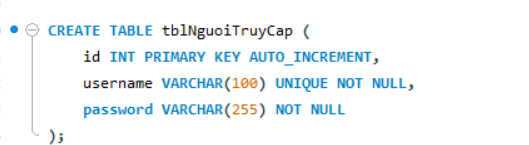

# Phần 1: Database (Tập trung vào CSDL quan hệ)

## 1. Cài đặt DBMS
- MySQL, SQL Server  
- Cài đặt local Workbench

<p align="center">
  
  <br/>
  <em>Hình 1: Cài đặt DBMS</em>
</p>

---

## 2. Các câu lệnh cơ bản với SQL
Sau khi cài đặt, tạo một CSDL cho bài toán: **Quản lý giải đấu vô địch cờ vua thế giới**

<p align="center">
  
  <br/>
  <em>Hình 2: Các câu lệnh cơ bản với SQL</em>
</p>

---

## Tạo các bảng

### Bảng `tblGiaiDau` — Lưu thông tin giải đấu
<p align="center">
  
  <br/>
  <em>Hình 3: Bảng tblGiaiDau</em>
</p>

### Bảng `tblNguoiTruyCap` — Người truy cập vào hệ thống
<p align="center">
  
  <br/>
  <em>Hình 4: Bảng tblNguoiTruyCap</em>
</p>

### Bảng `tblThanhVien` — Người dùng đăng nhập hệ thống
<p align="center">
  
  <br/>
  <em>Hình 5: Bảng tblThanhVien</em>
</p>

### Bảng `tblKyThu` — Thông tin kỳ thủ
<p align="center">
  
  <br/>
  <em>Hình 6: Bảng tblKyThu</em>
</p>

### Bảng `tblQuanLy`
<p align="center">
  
  <br/>
  <em>Hình 7: Bảng tblQuanLy</em>
</p>

### Bảng `tblBanToChuc`
<p align="center">
  
  <br/>
  <em>Hình 8: Bảng tblBanToChuc</em>
</p>

### Bảng `tblVongDau`
<p align="center">
  
  <br/>
  <em>Hình 9: Bảng tblVongDau</em>
</p>

### Bảng `tblTranDau`
<p align="center">
  
  <br/>
  <em>Hình 10: Bảng tblTranDau</em>
</p>

### Bảng `tblKyThuThamGia` — Sinh ra từ quan hệ `KyThu` & `TranDau`
<p align="center">
  
  <br/>
  <em>Hình 11: Bảng tblKyThuThamGia</em>
</p>

### Database tổng thể
<p align="center">
  
  <br/>
  <em>Hình 12: Sơ đồ ERD cơ sở dữ liệu</em>
</p>

---

## Thao tác dữ liệu DML

### INSERT
<p align="center">
  
  <br/>
  <em>Hình 13: Thao tác INSERT</em>
</p>

### UPDATE
<p align="center">
  
  <br/>
  <em>Hình 14: Thao tác UPDATE</em>
</p>

### DELETE
<p align="center">
  
  <br/>
  <em>Hình 15: Thao tác DELETE</em>
</p>

### SELECT
<p align="center">
  
  <br/>
  <em>Hình 16: Truy vấn SELECT</em>
</p>

---

## CASE
Phân loại giải đấu theo số lượng kỳ thủ.

<p align="center">
  
  <br/>
  <em>Hình 17: Câu lệnh CASE</em>
</p>

---

## JOIN
Hiển thị danh sách **vòng đấu của từng giải đấu** kèm theo **tên ban tổ chức**.

<p align="center">
  
  <br/>
  <em>Hình 18: Truy vấn JOIN</em>
</p>

---

## UNION
Gộp danh sách tất cả các mã người có quyền truy cập (quản lý + ban tổ chức).

<p align="center">
  
  <br/>
  <em>Hình 19: Truy vấn UNION</em>
</p>

---

## GROUP BY / HAVING
Đếm số kỳ thủ theo từng quốc gia.  
Chỉ lấy **quốc gia có từ 3 kỳ thủ trở lên**.

<p align="center">
  
  <br/>
  <em>Hình 20: Truy vấn GROUP BY HAVING</em>
</p>

---

## SubQuery
Lấy danh sách kỳ thủ có **eloTruocGiai cao nhất** trong toàn bộ hệ thống.

<p align="center">
  
  <br/>
  <em>Hình 21: Truy vấn con (SubQuery)</em>
</p>

---

## COMPUTE
Tính **tổng số kỳ thủ theo quốc gia và tổng toàn hệ thống**:

<p align="center">
  
  <br/>
  <em>Hình 22: Sử dụng COMPUTE</em>
</p>

---

## View

### 1. Tạo View
Tạo view hiển thị thông tin cơ bản kỳ thủ và tài khoản.

<p align="center">
  
  <br/>
  <em>Hình 23: Tạo View</em>
</p>

### 2. Cập nhật View
Một VIEW **có thể UPDATE, INSERT, DELETE** nếu:
- Dựa trên **1 bảng duy nhất** (không JOIN, không GROUP BY, không DISTINCT).
- Các cột trong view **ánh xạ trực tiếp** đến các cột trong bảng gốc.

---

## Điều khiển truy cập

### Cấp quyền cho người quản lý giải đấu
Người quản lý có quyền xem, thêm, sửa, xóa bảng `tblGiaiDau`:
```sql
GRANT SELECT, INSERT, UPDATE, DELETE 
ON QuanLyCoVua.tblGiaiDau 
TO 'ql_giaidau'@'localhost';
```


### Cấp quyền cho Ban tổ chức

Ban tổ chức chỉ cần:

- Xem thông tin giải (`tblGiaiDau`)
- Quản lý vòng đấu (`tblVongDau`)
- Cập nhật trận đấu (`tblTranDau`)

```sql
GRANT SELECT ON QuanLyCoVua.tblGiaiDau TO 'btc_giaidau'@'localhost';
GRANT SELECT, INSERT, UPDATE ON QuanLyCoVua.tblVongDau TO 'btc_giaidau'@'localhost';
GRANT SELECT, UPDATE ON QuanLyCoVua.tblTranDau TO 'btc_giaidau'@'localhost';

```

### Cấp quyền cho người xem (kỳ thủ, khách)

Người xem chỉ được đọc dữ liệu:

```sql
GRANT SELECT ON QuanLyCoVua.tblGiaiDau TO 'khach'@'localhost';
GRANT SELECT ON QuanLyCoVua.tblVongDau TO 'khach'@'localhost';
GRANT SELECT ON QuanLyCoVua.tblTranDau TO 'khach'@'localhost';

```

### REVOKE

- - Thu hồi quyền cập nhật từ ban tổ chức
```
REVOKE UPDATE ON QuanLyCoVua.tblTranDau FROM 'btc_giaidau'@'localhost';
```
- - Hoặc thu hồi toàn bộ quyền của khách
```
REVOKE ALL PRIVILEGES, GRANT OPTION FROM 'khach'@'localhost';
```

## Trigger

Tự động cập nhật số lượng kỳ thủ khi thêm người tham gia

<p align="center">
    
    <br/>
    <em>Hình 1: Sơ đồ quan hệ giữa các bảng trong hệ thống</em>
</p>

Ngăn không cho xóa giải đấu đang diễn ra

<p align="center">
    
    <br/>
    <em>Hình 1: Sơ đồ quan hệ giữa các bảng trong hệ thống</em>
</p>

### Transaction

Tạo vòng đấu mới và các trận đấu trong cùng một giao dịch

<p align="center">
    
    <br/>
    <em>Hình 1: Sơ đồ quan hệ giữa các bảng trong hệ thống</em>
</p>

Ví dụ dòng thứ 3 lỗi (trùng khóa, sai ràng buộc,…), sẽ hoàn tác: Toàn bộ dữ liệu vòng đấu và trận đấu **đều không được lưu**.

## **Phần 2: OOP**

1. **OOP trong Java**

**I. Java Cơ bản**

- **Object (Đối tượng):**
    - Là khái niệm trung tâm của OOP, là mô hình của một thực thể hay khái niệm trong thế giới thực.
    - Mỗi đối tượng có các thuộc tính (attribute) biểu diễn giá trị hay trạng thái, và các trách nhiệm (hành vi) thực hiện bằng cách cung cấp dịch vụ cho các đối tượng khác.
    - Các đối tượng được tạo ra khi chương trình chạy từ các lớp (class).
- **Class (Lớp):**
    - Là khuôn mẫu (template) để tạo ra các đối tượng (thực thể).
    - Mô tả tất cả các thuộc tính (biến thực thể) và phương thức (hành vi) của các đối tượng thuộc lớp đó.
    - Trong Java, mỗi file mã nguồn (.java) chứa một định nghĩa lớp.
- **Abstract Class (Lớp trừu tượng):**
    - Được dùng làm kiểu tổng quát hơn cho các lớp con .
    - Được khai báo bằng từ khóa `abstract` .
    - Có thể chứa cả các phương thức trừu tượng và không trừu tượng.
- **Interface (Giao diện):**
    - Là một cấu trúc lập trình của Java được định nghĩa với từ khóa `interface`.
    - Giống như một lớp thuần túy trừu tượng, chỉ bao gồm toàn các phương thức trừu tượng và không có biến thực thể.
    - Các phương thức trong interface đều ngầm định là `public` và `abstract`.
    - Một lớp cài đặt một interface sử dụng từ khóa `implements`.
- **Biến (Variable):**
    - Là tên của một vùng bộ nhớ dùng để lưu dữ liệu khi chương trình chạy.
    - Java là ngôn ngữ định kiểu mạnh, mỗi biến phải có kiểu dữ liệu xác định và được khai báo trước khi sử dụng.
    - Có hai loại chính:
        - **Biến địa phương (local variable):** Khai báo trong một hàm, có hiệu lực trong phạm vi hàm đó. Phải được khởi tạo trước khi sử dụng.
        - **Biến thực thể (instance variable):** Khai báo trong một lớp nhưng không trong một phương thức, biểu diễn trạng thái của đối tượng. Có giá trị mặc định nếu không khởi tạo .
        - **Biến lớp (class variable/static variable):** Dùng chung cho tất cả các đối tượng thuộc lớp đó, được khai báo với từ khóa `static`.
- **Hàm/Phương thức (Method):**
    - Là một thao tác hay dịch vụ được thực hiện đối với đối tượng.
    - Cài đặt hành vi của đối tượng và được định nghĩa trong định nghĩa lớp
    - Có thể có tham số và giá trị trả về.
    - **Phương thức trừu tượng (abstract method):** Không có thân phương thức, phải được cài đặt ở lớp con cụ thể.
    - **Phương thức lớp/static (class method/static method):** Tồn tại độc lập với các đối tượng, có thể gọi trực tiếp từ tên lớp mà không cần đối tượng. Không thể truy nhập biến thực thể hoặc phương thức thực thể.
- **I/O (Vào ra dữ liệu) và Thao tác File:**
    - **Serialization (Chuỗi hóa đối tượng):** Phương pháp ghi các đối tượng đã được chuỗi hóa vào file và khôi phục lại khi cần. Lớp cần cài đặt interface `Serializable`.
    - **File văn bản:** Ghi dữ liệu dạng text vào file, dễ đọc cho các chương trình khác hoặc con người.
    - **Stream (Dòng):** Đường ống dữ liệu, có dòng kết nối (FileOutputStream, FileInputStream, FileReader, FileWriter) và dòng nối tiếp (ObjectOutputStream, ObjectInputStream, BufferReader, BufferWriter, PrintWriter, DataInputStream, DataOutputStream).
    - **Lớp `File`:** Đại diện cho một file hoặc thư mục, có thể kiểm tra đường dẫn, tạo thư mục, liệt kê nội dung, xóa file.
    - **Bộ nhớ đệm (Buffer):** Tăng hiệu quả thao tác đọc/ghi dữ liệu (ví dụ: BufferWriter, BufferReader).
- **Vòng lặp (Loop):**
    - **Vòng `while`:** Lặp lại một chuỗi hành động nếu điều kiện lặp còn thỏa mãn. Kiểm tra điều kiện trước khi thực hiện thân vòng lặp.
    - **Vòng `do-while`:** Thân vòng lặp được thực hiện ít nhất một lần, sau đó mới kiểm tra điều kiện lặp
    - **Vòng `for`:** Hỗ trợ viết vòng lặp với số lần lặp được kiểm soát bằng biến đếm, gồm khởi tạo, điều kiện lặp và cập nhật
    - **Lệnh `break`:** Chấm dứt ngay lập tức cấu trúc lặp hoặc `switch`
    - **Lệnh `continue`:** Kết thúc lần lặp hiện hành của vòng lặp, chuyển sang lần lặp tiếp theo
## II. Các tính chất OOP (Lập trình hướng đối tượng)

- **Abstraction (Trừu tượng hóa):**
    - Là cơ chế cho phép biểu diễn một tình huống phức tạp bằng một mô hình đơn giản hóa, tập trung vào các tính chất quan trọng
    - Trong OOP, thế giới thực được trừu tượng hóa thành các đối tượng và tương tác giữa chúng
- **Encapsulation (Đóng gói):**
    - Các trừu tượng hóa liên quan được đóng gói vào một đơn vị duy nhất (lớp), bao gồm trạng thái (thuộc tính) và hành vi (phương thức)
    - Đi kèm với che giấu thông tin (information hiding), che giấu chi tiết bên trong của đối tượng khỏi thế giới bên ngoài
    - Thường thực hiện bằng cách đánh dấu biến thực thể là `private` và cung cấp các phương thức `public` `set` và `get`.
- **Inheritance (Thừa kế):**
    - Quan hệ phân cấp cho phép một lớp mới (lớp con/lớp dẫn xuất) được định nghĩa dựa trên một lớp có sẵn (lớp cha/lớp cơ sở), thừa hưởng các thành viên (biến thực thể và phương thức) của lớp cha
    - Lớp con chuyên biệt hóa lớp cha, có thể bổ sung tính năng mới hoặc cài đè (override) các phương thức thừa kế
    - Kiểm tra quan hệ IS-A để xác định có nên dùng thừa kế hay không
    - Lợi ích: tránh lặp mã, định nghĩa giao thức chung
- **Polymorphism (Đa hình):**
    - Là khả năng tồn tại ở nhiều hình thức
    - Trong OOP, đi kèm với thừa kế, có nghĩa cùng một tên (phương thức) có thể được hiểu theo các cách khác nhau tùy từng tình huống
    - Các đối tượng thuộc các lớp dẫn xuất khác nhau có thể được đối xử như nhau (ví dụ: dùng tham chiếu lớp cha cho đối tượng lớp con)
1. **Dependency Injection(DI), Inversion of Control(Ioc)**

Các khái niệm **Dependency Injection (DI)** và **Inversion of Control (IoC)** ra đời nhằm giải quyết bài toán giảm sự phụ thuộc giữa các module.

Giúp **code dễ bảo trì, mở rộng, kiểm thử và thay thế module** mà không làm ảnh hưởng đến các phần khác trong hệ thống.

**Dependency Inversion Principle** là nguyên lý cuối cùng trong bộ **SOLID**:

1. **Module cấp cao không nên phụ thuộc vào module cấp thấp.**
    
    Cả hai nên **phụ thuộc vào abstraction (interface hoặc class trừu tượng)**.
    
2. **Interface không nên phụ thuộc vào chi tiết**, mà ngược lại.
    
    Nói cách khác, các class nên giao tiếp **qua interface**, chứ không trực tiếp gọi nhau.
    

## Phân biệt 3 khái niệm: DIP – IoC – DI

| Khái niệm | Bản chất | Vai trò |
| --- | --- | --- |
| **Dependency Inversion** | *Nguyên lý thiết kế* trong SOLID | Hướng dẫn cách tổ chức code sao cho module cấp cao không phụ thuộc trực tiếp module cấp thấp. |
| **Inversion of Control (IoC)** | *Design Pattern*  | Cách thực hiện nguyên lý Dependency Inversion – đảo ngược quyền điều khiển tạo và quản lý đối tượng. |
| **Dependency Injection (DI)** | *Kỹ thuật cụ thể để thực hiện IoC* | Tiêm các phụ thuộc cần thiết vào class thay vì để class tự tạo. |
- **DIP** là nguyên lý.
- **IoC** là mẫu thiết kế giúp hiện thực nguyên lý đó.
- **DI** là **một trong các cách cụ thể để hiện thực IoC**.

### Định nghĩa

**Dependency Injection (DI)** là kỹ thuật trong đó **các phụ thuộc (dependencies)** của một module **được truyền vào từ bên ngoài**, thay vì module đó tự khởi tạo chúng.

Điều này giúp module:

- **Không phụ thuộc trực tiếp** vào các lớp cụ thể.
- **Dễ thay đổi, mở rộng hoặc kiểm thử.**

Giả sử ta có 2 module:

- Module cấp thấp: `XMLDatabase`, `SQLDatabase` (thực hiện việc lưu dữ liệu).
- Module cấp cao: `CustomerBusiness` (xử lý logic nghiệp vụ).

**Theo DI:**

1. Cả 2 module đều phụ thuộc vào interface `IDatabase`.
2. Việc gắn module nào (SQL hay XML) cho `IDatabase` sẽ do **DI Container** hoặc **cấu hình ngoài** quyết định.
3. `CustomerBusiness` chỉ biết đến `IDatabase`, không biết `SQLDatabase` hay `XMLDatabase`.

### Các dạng Dependency Injection

| Loại Injection | Mô tả | Ví dụ |
| --- | --- | --- |
| **Constructor Injection** | Truyền dependency thông qua hàm khởi tạo. | `public CustomerBusiness(IDatabase db)` |
| **Setter Injection** | Truyền dependency qua các hàm setter. | `setDatabase(IDatabase db)` |
| **Interface Injection** | Class cần tiêm cài đặt interface có hàm `Inject()`, Container sẽ gọi hàm đó. | Ít dùng vì rườm rà. |

## Ưu điểm và Nhược điểm của Dependency Injection

| Ưu điểm | Nhược điểm |
| --- | --- |
| Giảm sự kết dính giữa các module  | Tăng độ phức tạp trong thiết kế. |
| Code dễ mở rộng và bảo trì. | Khó học đối với developer mới. |
| Dễ test do có thể inject mock object. | Khó debug vì các lớp giao tiếp qua interface. |
| Dễ thay đổi module (chỉ cần đổi cấu hình hoặc DI Container). | Các object có thể bị tạo dư thừa → giảm hiệu năng nếu không quản lý tốt. |

## VI. Mối quan hệ giữa IoC và DI

**IoC** ý tưởng:

> Thay vì lập trình viên chủ động tạo và quản lý dependency, framework hoặc container sẽ làm việc đó.
> 

**DI** là **một kỹ thuật cụ thể để hiện thực IoC**, thông qua việc **tiêm phụ thuộc vào các class cần dùng**.

### Ví dụ:

- **IoC:** Framework quyết định đối tượng nào được tạo, và khi nào.
- **DI:** Các đối tượng đó được **tiêm vào** các class sử dụng chúng.

## DI Container

Trong thực tế, để hỗ trợ việc inject tự động, ta sử dụng các **DI Container (hoặc IoC Container)** — là thư viện hoặc framework giúp:

- Quản lý vòng đời của các object.
- Khởi tạo và tiêm dependencies vào các module.
- Cấu hình dependency thông qua code hoặc file XML.

Ví dụ về DI Container phổ biến:

- **C#:** Unity, Autofac, Ninject, StructureMap
- **Java:** Spring Framework
- **JavaScript:** InversifyJS

## Dependency

**Dependency** hiểu đơn giản là một **module cần dùng chức năng của module khác** để hoạt động.

Thông thường, chia code thành **module cấp cao** (xử lý nghiệp vụ) và **module cấp thấp** (xử lý chi tiết kỹ thuật). Khi module cấp cao phải **tự tạo ra và gọi** module cấp thấp, thì nó đã bị phụ thuộc vào chi tiết của module đó.

Ví dụ:

Giả sử em có một ứng dụng quản lý **quán cà phê**. Trong đó có class `OrderService` để xử lý đơn hàng, và class `Database`, `Printer`, `EmailSender` để lưu dữ liệu, in hóa đơn và gửi email xác nhận.

Nếu viết code như thế này:

```csharp
public class OrderService
{
    public void CheckoutOrder(int orderId, int customerId)
    {
        Database db = new Database();
        db.Save(orderId);

        Printer printer = new Printer();
        printer.PrintBill(orderId);

        EmailSender email = new EmailSender();
        email.SendConfirmation(customerId);
    }
}
```

Cách này **chạy được**, nhưng có nhược điểm lớn:

- Mỗi khi muốn thay đổi database (ví dụ từ MySQL sang MongoDB), phải **sửa toàn bộ code**.
- Rất **khó test** riêng từng phần, vì mọi thứ dính chặt vào nhau.
- Khi project lớn dần, các module bị **kết dính chặt** làm code khó bảo trì.

## Inversion of Control (IoC) và cách giảm sự phụ thuộc

Để tránh các class dính chặt lẫn nhau, người ta dùng nguyên tắc **Inversion of Control**

Thay vì `OrderService` **tự tạo** `Database`, ta sẽ để một **thành phần khác bên ngoài** chịu trách nhiệm “cấp” (inject) `Database` cho nó.

Ta có thể tách các chức năng ra thành **interface** như sau:

```csharp
public interface IDatabase
{
    void Save(int orderId);
}

public interface IPrinter
{
    void PrintBill(int orderId);
}

public interface IEmailSender
{
    void SendConfirmation(int customerId);
}
```

Và các module cụ thể sẽ **implement** những interface này:

```csharp
public class Database : IDatabase
{
    public void Save(int orderId) { /* ... */ }
}

public class Printer : IPrinter
{
    public void PrintBill(int orderId) { /* ... */ }
}

public class EmailSender : IEmailSender
{
    public void SendConfirmation(int customerId) { /* ... */ }
}
```

Giờ `OrderService` sẽ **không phụ thuộc vào chi tiết cụ thể nữa**, mà chỉ cần biết nó có một thứ có thể `Save`, một thứ có thể `PrintBill`, và một thứ có thể `SendConfirmation`.

## Dependency Injection (DI)

Đây chính là bước thực hiện IoC.

Thay vì tự tạo dependency bên trong, ta **inject** chúng từ bên ngoài — có thể qua **constructor**, **setter**, hoặc **interface**.

Ví dụ:

```csharp
public class OrderService
{
    private readonly IDatabase _db;
    private readonly IPrinter _printer;
    private readonly IEmailSender _email;

    // Tiêm các dependency qua constructor
    public OrderService(IDatabase db, IPrinter printer, IEmailSender email)
    {
        _db = db;
        _printer = printer;
        _email = email;
    }

    public void CheckoutOrder(int orderId, int customerId)
    {
        _db.Save(orderId);
        _printer.PrintBill(orderId);
        _email.SendConfirmation(customerId);
    }
}
```

Khi sử dụng:

```csharp
var orderService = new OrderService(
    new Database(),
    new Printer(),
    new EmailSender()
);

orderService.CheckoutOrder(1, 1001);
```

Nếu sau này mình muốn đổi database, chỉ cần tạo class mới `MongoDatabase` rồi truyền vào:

```csharp
var orderService = new OrderService(
    new MongoDatabase(),
    new Printer(),
    new EmailSender()
);
```

Không cần sửa logic trong `OrderService` nữa 

## Kết luận

- **Inversion of Control** giúp giảm sự phụ thuộc đó bằng cách đảo ngược việc khởi tạo: module cấp cao không tự tạo module cấp thấp.
- **Dependency Injection** là một cách thực hiện IoC — bằng cáchinject các dependency vào từ bên ngoài.

Nhờ DI, code trở nên:

- Dễ thay đổi, mở rộng.
- Dễ kiểm thử
- Giảm lỗi và tăng khả năng tái sử dụng.

Tuy code có thể “dài hơn” và hơi phức tạp, nhưng trong các dự án lớn, DI gần như là tiêu chuẩn bắt buộc — đặc biệt trong các framework như **Spring** hoặc **ASP.NET Core.**
